[](https://classroom.github.com/a/tbEHDGEc)  

# Pengantar Git dan GitHub  

| Nama         | Divisi       | Sub-Divisi   |
| ------------ | ------------ | ------------ |
| Wikandika Setya Nugroho| PGR      | Vision & Control   |  

---

## **Panduan Git & GitHub**  

### **A. Prosedur Awal**  
1. **Instal Git:**  
   Unduh dan pasang Git di [sini](https://git-scm.com/downloads).  
2. **Buat Akun GitHub:**  
   Daftar di [GitHub](https://github.com/join).  
3. **Konfigurasi Git:**  
   ```bash
   git config --global user.name [username]
   git config --global user.email [email]
   ```  
   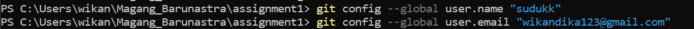
4. **Tambahkan SSH Key:**  
   - Masuk ke GitHub > **Settings > SSH and GPG Keys > New SSH Key**.  
   - Buat key di Git Bash:  
     ```bash
     ssh-keygen -t ed25519 -C [email]
     ```  
     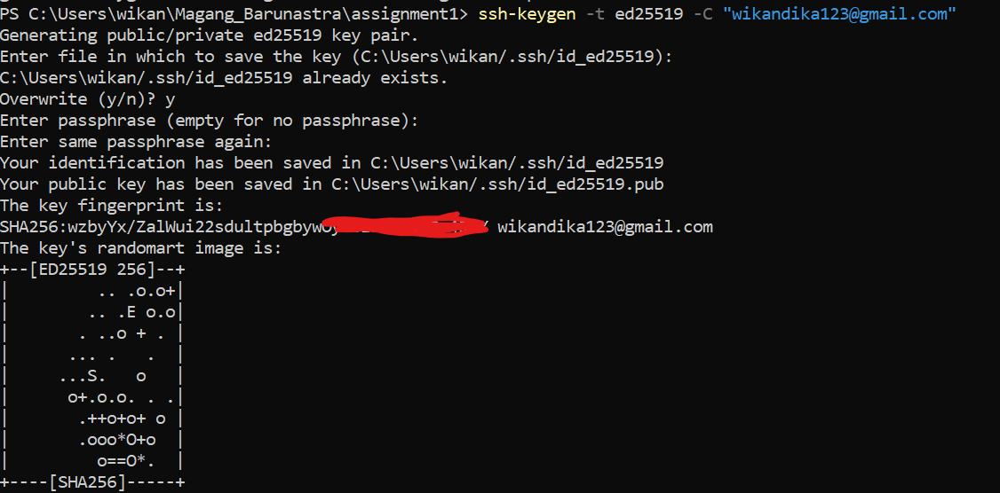
   - Salin key dengan:  
     ```bash
     clip < ~/.ssh/id_ed25519.pub
     ```  
    - Atau dengan menggunakan cat lalu di copy:  
     ```bash
     cat [lokasi dari id_ed25519.pub (ex: /.ssh/id_ed25519.pub)]
     ```  
     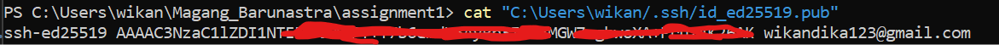
   - Paste ke GitHub di **New SSH Key**.  
     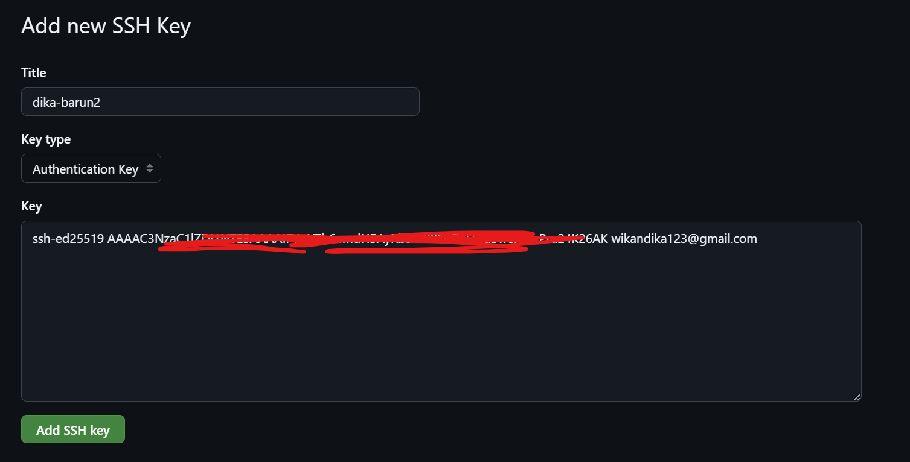
     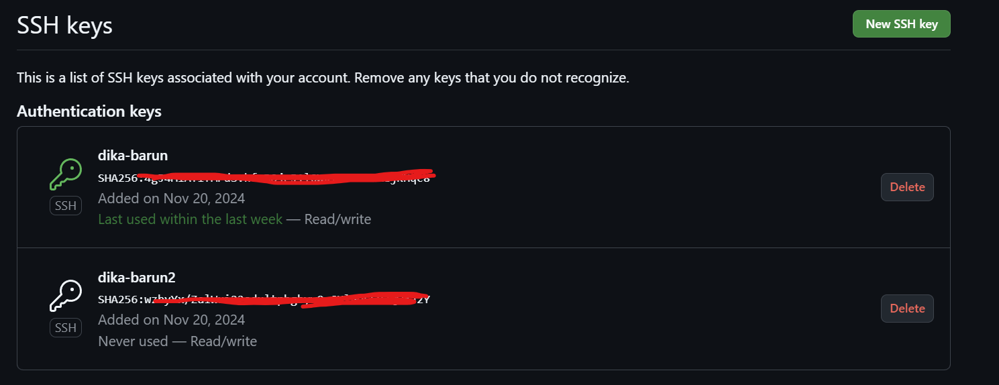

---

### **B. Membuat Repository**  
1. Buka [laman repository baru](https://github.com/new).  
2. Isi nama repository, pilih **Public/Private**, dan klik **Create repository**.  
3. Salin link SSH repository (di menu **Code > SSH**).  
4. Hubungkan repository lokal:  
   - **Manual:**  
     - Buat folder di File Explorer.  
     - Buka cmd di folder tersebut, lalu jalankan:  
       ```bash
       git init
       git remote add origin [link repo SSH yang dituju]
       git branch -M main
       git pull origin main
       ```  
       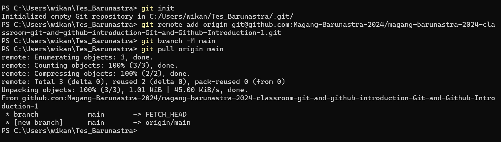
   - **Git Clone:**  
     - Jalankan:  
       ```bash
       git clone [link repo SSH yang ingin diclone]
       ```  
       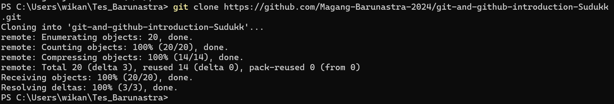
     - Folder repository akan muncul di lokasi Anda.  
       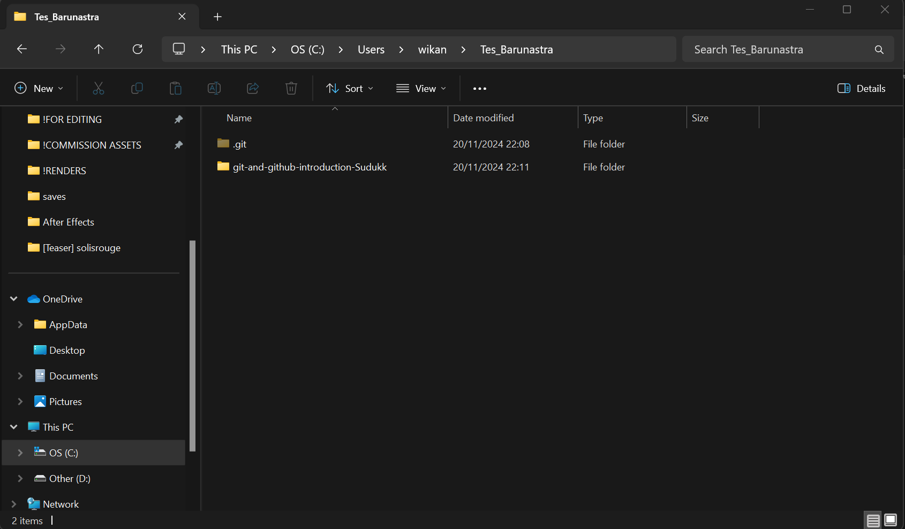

---

### **C. Mengunggah File ke GitHub**  
1. Tambahkan file ke folder lokal.  
2. Buka Git Bash di folder tersebut dan jalankan:  
   ```bash
   git add .
   git commit -m "[Deskripsi commit]"
   git push origin main
   ```  
   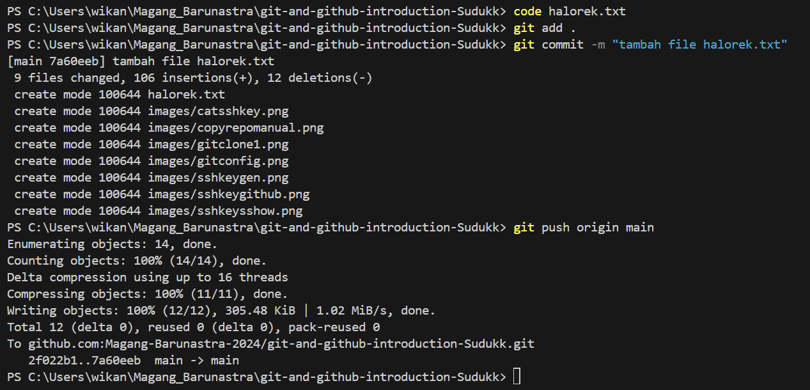

---

### **D. Membuat Branch Baru**  
1. Jalankan:  
   ```bash
   git checkout -B [nama-branch]
   ```  
   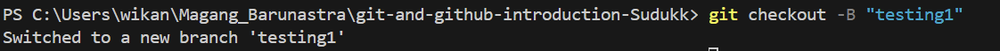
2. Untuk beralih ke branch lain:  
   ```bash
   git checkout [nama-branch]
   ```  
   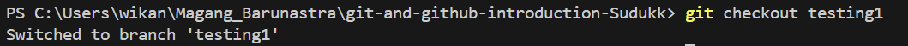

---

### **E. Menghapus Branch**  
1. Beralih ke branch lain:  
   ```bash
   git checkout [nama-branch-lain]
   ```  
   
2. Hapus branch:  
   ```bash
   git branch -d [nama-branch]
   ```  
   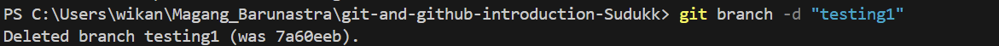

---

### **F. Menggabungkan Branch**  
1. Beralih ke branch utama:  
   ```bash
   git checkout main
   ```  
2. Gabungkan branch lain:  
   ```bash
   git merge [nama-branch]
   ```  
   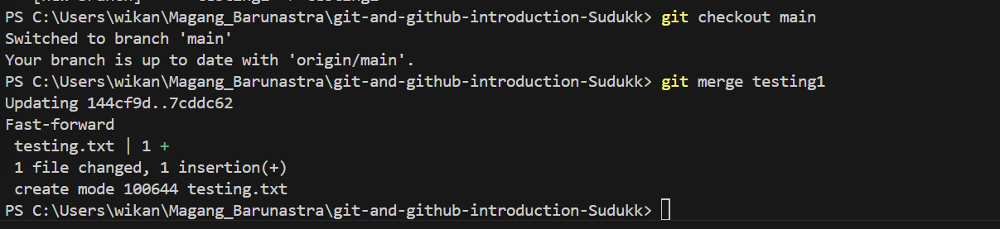
